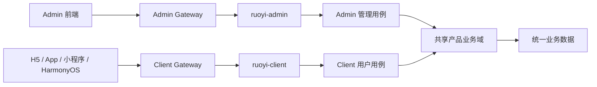

# AI 多端产品工程脚手架

面向中型及大型产品的工程基线：五个完全独立的前端、Admin/Client 两个后端入口、一套共享产品业务域。

> Client 是业务发生端，Admin 是业务管理端；两端身份和接口隔离，核心业务规则与业务数据统一。

## 工程组成

| 工程 | 定位 | 默认入口 |
| --- | --- | --- |
| `backend/ruoyi-admin` | PC 后台的管理员认证、系统管理、运营和审核入口 | `8080` |
| `backend/ruoyi-client` | H5、App、小程序、HarmonyOS 的产品用户业务入口 | `8082` |
| `web/admin` | PC 管理后台（Umi + Ant Design） | `8000` |
| `web/h5` | 移动 H5（Vite + antd-mobile） | `8081` |
| `web/app` | iOS / Android（React Native） | 原生工具链 |
| `web/miniapp` | 微信小程序（Taro） | 平台工具链 |
| `web/harmony` | HarmonyOS（Taro） | 平台工具链 |

五个前端不使用 workspace、monorepo 或共享源码包。每端独立维护 `package.json`、锁文件、请求层、状态层和构建流程；只共享设计规范和后端契约。

## 后端关系



- 管理员使用 `sys_user/sys_role/sys_menu` 和 Admin Token。
- 产品用户使用 `client_user/client_identity/client_application` 和 Client Token。
- 两套 Token 的 Sa-Token loginType、Redis 空间、clientid 和接口路径均隔离。
- 后续订单、内容、商品等业务表属于共享产品业务域，不为 Admin/Client 复制两份。

详细边界见 [工程架构基线](docs/工程架构基线.md)。

## 本地启动

```bash
bash scripts/start-dev.sh
```

脚本会启动 MySQL、Redis、Admin 服务和 Client 服务。

- Admin：`http://localhost:8080`，默认 `admin / admin123`
- Client：`http://localhost:8082`，默认 `client / admin123`，手机号 `13800138000`

前端按需独立启动：

```bash
cd web/admin && pnpm install && pnpm dev
cd web/h5 && pnpm install && pnpm dev
cd web/app && npm install && npm run ios
cd web/miniapp && pnpm install && pnpm dev:weapp
cd web/harmony && pnpm install && pnpm dev:harmony
```

## 生产参考

- `infra/docker-compose.prod.yml`：Admin/Client 双服务和双 Gateway 参考编排。
- `infra/gateway/admin.nginx.conf`：后台入口策略。
- `infra/gateway/client.nginx.conf`：用户端限流、路由和后端隐藏策略。
- `infra/init/01-init.sql`：Admin 身份、Client 身份和基础能力初始化。
- Admin 增量迁移：`backend/ruoyi-admin/src/main/resources/db/migration/`。
- Client 增量迁移：`backend/ruoyi-client/src/main/resources/db/client/`。

真实前后端契约与开发约定见 [CLAUDE.md](CLAUDE.md)。
