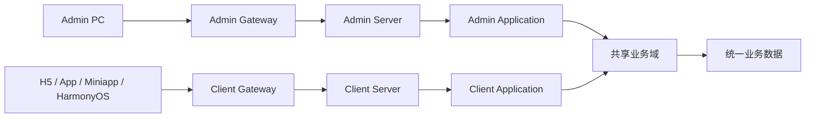

# 工程架构基线

## 1. 业务定位

系统首先存在面向产品用户的 Client 业务，再存在围绕同一业务进行运营、审核、配置和管理的 Admin 后台。

Admin 和 Client 不是两套产品，也不是 Admin 创建 Client：

- Client 是业务发生端。
- Admin 是业务管理端。
- 两端接口与身份隔离。
- 核心业务规则、状态机和业务数据统一。

## 2. 总体结构

Admin Server 和 Client Server 可独立部署、扩容和发布；任何一方停止都不应使另一方因同步服务调用而无法运行。它们通过共享领域代码和统一业务数据保持规则一致，而不是互相调用公开 API。

## 3. 模块职责

| 分层 | 模块 | 职责 |
| --- | --- | --- |
| 启动 | `ruoyi-admin` | 后台管理服务组装，端口 8080 |
| 启动 | `ruoyi-client` | 四个用户端统一服务组装，端口 8082 |
| 接口 | `ruoyi-interfaces` | Admin/Client HTTP DTO 和 Controller |
| 应用 | `ruoyi-applications` | 两种角色视角的用例编排 |
| 领域 | `ruoyi-domains` | 产品用户域与后续产品业务规则 |
| 安全 | `ruoyi-security` | 两套登录主体、Token 和访问策略 |
| 后台能力 | `ruoyi-admin-modules` | 系统、工作流、代码生成、任务等管理能力 |
| 基础设施 | `ruoyi-infrastructure` | JDBC、数据库和中间件适配 |
| 外部集成 | `ruoyi-integrations` | 微信、短信及后续支付/推送等适配 |
| 技术底座 | `ruoyi-common` | JSON、Web、Redis、加密等技术机制 |

## 4. 身份与数据

| 内容 | Admin | Client |
| --- | --- | --- |
| 主体 | 管理员、运营、审核人员 | 产品用户 |
| 用户表 | `sys_user` | `client_user` |
| 权限 | RBAC、菜单、部门、数据权限 | 资源归属、权益和业务授权 |
| Token loginType | 默认 Admin loginType | `client` |
| 客户端配置 | `sys_client` | `client_application` |
| API | `/auth/**`、`/system/**` 等 | `/client-auth/**`、`/client-api/**` |

订单、内容、商品等业务数据只保存一份。管理端写操作必须调用共享领域规则，禁止直接通过后台 Mapper 绕过状态机。

## 5. 多端契约

H5、App、微信小程序和 HarmonyOS 统一使用 `/client-api/**`，通过不同 `clientid`、`deviceType` 和授权方式区分客户端。不会创建四个对称 Channel 模块。

- H5：账号、手机号、短信。
- App：账号、手机号、短信。
- 微信小程序：账号或微信 `xcx` 身份交换。
- HarmonyOS：账号、手机号、短信等通用方式，不复用微信登录。

## 6. 部署边界

- Admin Gateway：适合内网/VPN、IP 限制、MFA、后台审计策略。
- Client Gateway：适合公网限流、防刷、设备和版本策略。
- 开发环境共用 MySQL/Redis 物理实例；Client 使用独立 Redis database 与 key prefix。
- 生产环境后端端口不直接暴露，只暴露两个 Gateway。

## 7. 前端独立性

五端只共享规范和 API 文档，不共享运行时代码：不建立根前端 workspace，不跨端引用源码，每端独立锁定依赖、管理请求层和产物。
