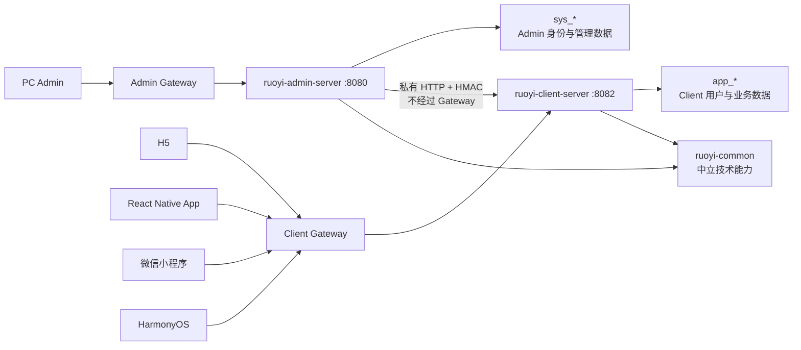

# 工程现状与开发导航

> 核验日期：2026-08-14
> 架构基线：当前 `main`（以本文所在提交为准）
> 适用对象：产品负责人、架构师、AI 编码助手、后端开发、前端开发、运维与新成员
> 文档性质：当前事实快照。稳定约束仍以根目录 `CLAUDE.md` 为准，接口字段仍以真实 Controller、VO 和数据库脚本为准。

## 1. 一句话结论

当前仓库已经是一套边界清晰、能够继续填充业务的中大型多端工程脚手架：

- 后端由 Admin、Client、Common 三个责任边界和一个根聚合工程组成；
- Admin 是 PC 运营管理后台，Client 是四个用户端的后台服务；
- Admin 与 Client 的身份、Java API、登录上下文、数据表、Redis 会话和网关入口已经隔离；
- Admin 通过受保护的私有 HTTP 接口运营 Client 数据，不直接依赖 Client 的 Entity、Mapper 或 Service；
- PC Admin、H5、React Native App、微信小程序、HarmonyOS 是五个完全独立的前端工程；
- 双 Gateway、生产容器网络、Client 用户体系和四端登录纵切面已经打通；
- GitHub Spec Kit `v0.16.3` 已以需求优先方式接入，Codex 与 Claude Code 共享需求工件和人工门禁；
- 真实产品业务域尚未填充，这正是脚手架留给复制后项目开发的部分。

它不是“AI 产品工厂”业务系统，也不是一个已经填满订单、内容、会员、支付等业务的成品。仓库名称只是脚手架名称，不能据此生成任何业务模块。

## 2. 当前成熟度

| 范围 | 状态 | 当前结论 |
|---|---|---|
| 工程所有权 | 已落地 | 根、Admin、Client、Common 的 Maven 与物理目录归属一致，无泛化模块桶或空壳分层工程 |
| Admin 后台底座 | 已落地 | 系统管理、权限、工作流、代码生成、监控、Client 运营入口可用 |
| Client 身份底座 | 已落地 | 用户、接入客户端、第三方身份、四种登录策略、会话实时复核可用 |
| Admin→Client 运营链路 | 已落地 | 私有 HTTP、HMAC、时间窗、nonce 防重放、操作人审计已接通 |
| 五端独立工程 | 已落地 | 各端独立依赖、请求层、环境、Token、主题和构建，不共享源码 |
| Client 真实业务 | 待填充 | 当前只有 UM 与认证，没有预造订单、内容、会员等业务模块 |
| 用户端业务页面 | 待填充 | 四个 Client 前端主要完成登录、当前用户、退出和主题纵切面 |
| 生产部署基线 | 部分完成 | 双 Gateway、私网和密钥入口已具备；高可用、观测和发布流水线未完成 |
| 多数据库 | 脚本兼容 | 五种脚本已同步；当前应用和生产编排仍以 MySQL 为主要验证目标 |
| 自动化门禁 | 部分建设 | 已有版本基线、Spec Kit 集成和需求工件的本地检查；当前没有 GitHub Actions、完整范围门禁或完整自动化测试门禁 |
| 版本基线 | 已落地 | JDK/Node 使用最新 LTS 补丁，主框架/TypeScript 使用最新 GA 或有依据的最新兼容稳定版，并有本地机器校验 |
| 需求优先 SDD / Spec Kit | 已落地 | 根 `.specify/` 统一约法，Codex / Claude Code Skills 共享 `specs/`；Spec、Plan、Tasks 分别人工确认，Analyze 后仍需明确授权才能 Implement |

## 3. 总体架构



这是一套“双应用模块化单体”架构，不是微服务集群：

- Admin 和 Client 是两个独立 Spring Boot 运行进程；
- Client 内部当前由 API、Server、UM 三个真实模块构成；
- 后续可以按订单、内容、会员等真实业务域继续增加 Client 模块；
- 只有当业务边界、团队和部署需求真实出现时，才将 Client 模块拆成独立微服务；
- 当前 Gateway 是基础设施级 Nginx Gateway，不是 Spring Cloud Gateway。

## 4. 后端工程结构

```text
backend/
├── pom.xml                         # 唯一完整构建入口，统一版本/依赖/插件
├── ruoyi-admin/                    # Admin 总工程
│   ├── ruoyi-admin-api/            # System、Workflow、Admin 登录 Java 契约
│   ├── ruoyi-system/               # 系统管理实现
│   ├── ruoyi-gen/                  # 代码生成
│   ├── ruoyi-job/                  # 任务执行
│   ├── ruoyi-workflow/             # 工作流实现
│   ├── ruoyi-ai/                   # AI 接入
│   ├── ruoyi-demo/                 # 技术能力示例
│   └── ruoyi-admin-server/         # PC Admin 后端，端口 8080
├── ruoyi-client/                   # Client 总工程
│   ├── ruoyi-client-api/           # Client 登录与私有管理 Java 契约
│   ├── ruoyi-client-um/            # 用户、接入客户端、第三方身份
│   └── ruoyi-client-server/        # 四个用户端后台，端口 8082
├── ruoyi-common/                   # 中立技术模块，无 common-api
└── ruoyi-extend/                   # 独立扩展服务
    ├── ruoyi-monitor-admin/
    ├── ruoyi-snailai-server/
    └── ruoyi-snailjob-server/
```

### 4.1 所有权与依赖方向

| 工程 | 拥有什么 | 可以依赖 | 禁止依赖 |
|---|---|---|---|
| Admin | PC 管理接口、管理员权限、管理日志、System/Workflow 等 | Common、Admin API、Client API | Client UM、Client Entity/Mapper/Service |
| Client | 用户端接口、Client 身份、未来业务域、私有管理实现 | Common、Client API、Client 业务模块 | Admin API、Admin System 实现 |
| Common | Web、Redis、MyBatis、Sa-Token、加密、短信等中立技术能力 | 更底层公共库 | Admin/Client 业务 API 与实现 |
| 根工程 | 版本、依赖、插件和完整 Reactor | 所有聚合工程 | 业务实现 |

Admin 与 Client 的业务模块都直接位于各自总工程下，物理位置与 Maven 所有权一致。不再使用 `ruoyi-modules`、`business-modules` 等跨边界泛化目录。新增 Admin 模块放入 `backend/ruoyi-admin/`，新增 Client 模块放入 `backend/ruoyi-client/`。

`ruoyi-admin/ruoyi-gen` 保留上游生成器的 Admin 表、权限和 `BaseEntity` 语义，它不是 Client 通用生成器。Client 可参考其 Entity/BO/VO/Mapper/Service/Controller 分层，但必须对齐 `AppBaseEntity`、`app_*` 表与 Client 七要素。

### 4.2 API 模块规则

- `ruoyi-admin-api` 只放存在真实 Admin 跨模块消费者的 Java 契约；
- `ruoyi-client-api` 只放 Client 会话、认证请求和 Admin→Client 私有调用契约；
- HTTP Controller 专用响应、Entity、Mapper、Service、Excel VO 不放 API 模块；
- Common 不建立 `common-api`；中立的最小技术接口放在对应 Common 技术模块；
- 没有真实消费者时，不预建 API、微服务或 `package-info` 空壳。

## 5. Admin 与 Client 的关系

Admin 不是 Client 的上游业务主体，也不是四端接口容器。正确关系是：

```text
Client 先拥有用户业务和业务规则
                 ↓
需要运营管理时，由 Client 暴露私有管理能力
                 ↓
Admin 负责管理员权限、操作日志、页面和调用适配
```

现有运营调用链：

```text
Admin 浏览器
  → /client/user/** 或 /client/application/**
  → Admin 权限、日志、脱敏、防重复提交
  → ClientManagementHttpServiceImpl
  → HMAC-SHA256 + timestamp + nonce + operatorId + body digest
  → 私有网络直连 Client /internal/admin/v1/**
  → Client 验签、时间窗、Redis nonce 防重放
  → Client UM Service
  → app_*
```

内部调用不会转发浏览器 Token、Admin clientid 或部门 ID。两个 Gateway 都固定拒绝 `/internal/**` 和 `/prod-api/internal/**`。

## 6. 身份、鉴权与会话

| 维度 | Admin | Client |
|---|---|---|
| 用户表 | `sys_user` | `app_user` |
| 接入客户端表 | `sys_client` | `app_client` |
| 第三方身份表 | `sys_social` | `app_user_identity` |
| 登录上下文 | `AdminLoginUser` | `ClientLoginUser` |
| 当前用户接口 | `/system/user/getInfo` | `/client/user/info` |
| Redis | database 0；生产前缀 `admin` | database 1；前缀 `client` |
| 权限模型 | 角色、菜单、部门、数据权限 | 当前只建立用户身份，不预设业务角色/权益 |

受保护请求必须同时携带：

```http
Authorization: Bearer <token>
clientid: <当前端对应 clientid>
```

通用安全层会校验登录态、Token/clientid 一致性、允许访问路径与 IP 白名单。Client 的 `/client/**` 还会实时复核：

- 应用用户仍存在且 `valid_flag=1`；
- 接入客户端仍存在且 `valid_flag=1`；
- 用户 `credential_version` 与 Token 一致；
- 当前路径和 IP 仍在最新允许范围内。

因此停用用户、停用接入客户端或重置密码后，旧 Token 会在下一次 Client 受保护请求时失效。

## 7. Client 数据模型

当前 Client UM 拥有三张表：

| 表 | 作用 |
|---|---|
| `app_user` | Client 应用用户账号与基础资料 |
| `app_client` | H5、App、小程序、HarmonyOS 的接入与授权配置 |
| `app_user_identity` | 微信等第三方身份与应用用户绑定 |

所有新 `app_*` 表必须使用统一七要素：

| 字段 | 含义 | 约定 |
|---|---|---|
| `id` | 主键 | 雪花 ID，不自增 |
| `valid_flag` | 是否有效 | `1=有效`、`0=无效` |
| `del_flag` | 是否删除 | 逻辑删除 |
| `create_by` | 创建人 | Client 用户或经签名传入的 Admin 操作人 |
| `create_time` | 创建时间 | 自动填充 |
| `update_by` | 修改人 | 自动填充 |
| `update_time` | 修改时间 | 自动填充 |

App 表没有 `create_dept`，也没有通用 `version`。Admin 的 `sys_*` 表继续遵循各自原有 RuoYi 字段，不要求与 App 表相同。

`app_user.credential_version` 是密码重置后撤销旧会话的安全业务字段，不是通用乐观锁字段。

当前 MySQL、PostgreSQL、Oracle、SQL Server 基线脚本中的三张 App 表已保持逻辑字段、顺序、业务语义、约束/索引意图和种子数据一致；物理类型与列说明使用各数据库方言的等价表达。应用实际生产编排仍以 MySQL 8 为主，本轮只实际执行验证了 MySQL 8 和 PostgreSQL；不能仅凭脚本存在就宣称 Oracle、SQL Server 已完成运行验证。

## 8. 五个独立前端

| 工程 | 技术栈 | 对接服务 | 当前端侧能力 | 当前定位 |
|---|---|---|---|---|
| `web/admin` | Umi 4、React 19、Ant Design 6、ProComponents | Admin 8080 | 完整后台框架及 Client 用户/接入应用运营 | 可直接承接管理业务 |
| `web/h5` | Vite 8、React 19、antd-mobile 5 | Client 8082 | 密码登录、验证码、当前用户、退出、主题 | 业务填充骨架 |
| `web/app` | React Native 0.86、React 19、Ant Design RN | Client 8082 | 手机号密码、短信登录、当前用户、退出、主题 | 业务填充骨架 |
| `web/miniapp` | Taro 4、React 18、微信插件 | Client 8082 | 微信授权登录、首次身份绑定、当前用户、退出、主题 | 业务填充骨架 |
| `web/harmony` | Taro 4、React 18、Harmony CPP | Client 8082 | 密码/短信登录、原生加密与存储、当前用户、退出、主题 | 业务填充骨架 |

五端独立的含义是：

- 各自安装依赖、维护锁文件、编译和部署；
- 各自拥有请求层、API 类型、环境配置、Token Key、主题和平台适配；
- 禁止跨工程源码 import、共享运行包或共享构建产物；
- 契约一致通过“各端分别遵守同一后端接口”实现，不通过复制平台专属代码实现。

各端 Client 接入配置：

| 前端 | deviceType | 后端允许 grantType |
|---|---|---|
| H5 | `h5` | `password,sms` |
| App | `app` | `phonePassword,sms` |
| 微信小程序 | `miniapp` | `xcx` |
| HarmonyOS | `harmony` | `password,sms` |

当前四个 Client 前端主要完成了认证纵切面，真实业务导航、页面和 API 尚未填充。不要把“能登录”误解为“产品已完成”。

## 9. Gateway 与部署边界

生产使用 `infra/docker-compose.prod.yml`：

- 只有 `admin-gateway` 和 `client-gateway` 发布宿主机端口；
- Admin Backend、Client Backend、MySQL 和 Redis 只在容器网络内可见；
- Admin 与 Client 分别连接自己的 edge/data 网络；
- `admin-client-internal` 只包含两个 Backend；
- 两个 Gateway 分别路由 Admin 和 Client，不互相转发；
- `/prod-api/**` 去掉前缀后再进入对应后端；
- Gateway 提供路由、请求 ID、安全响应头和粗粒度限流；
- 用户权限、数据权限、clientid、应用范围和业务校验仍属于后端；
- TLS、证书、HSTS 由外部可信入口负责，仓库内 Nginx 只监听 HTTP。

这是一套安全部署基线，不是完整高可用平台。当前未包含：

- 前端静态站点、CDN、App Store、小程序或 HarmonyOS 发布；
- MySQL/Redis 高可用、备份与恢复演练；
- Backend/Gateway 多副本和负载均衡；
- 集中日志、指标、链路追踪和告警；
- Secrets Manager 或平台级密钥托管；
- CI/CD 与制品推广流水线。

## 10. 已实现的业务无关能力

Admin 侧保留了 RuoYi 的系统管理、角色权限、部门数据权限、字典、参数、OSS、日志、在线用户、工作流、任务、代码生成、监控和 Demo 等底座。

Common 提供 Web、JSON、MyBatis-Plus、Redis、Sa-Token、加密、敏感信息、Excel、OSS、短信、邮件、社交登录、推送、任务、AI/MCP 等技术模块。

这些能力是可选技术底座，不等于具体产品必须全部启用。复制脚手架时应按真实需求裁剪 `ruoyi-ai`、`ruoyi-demo`、Workflow、Job、MCP、MQTT 等模块，禁止为了“看起来完整”保留无消费者能力。

## 11. 明确没有的内容

当前仓库没有：

- `ruoyi-product` 或任何“产品工厂”业务模块；
- `channel-h5`、`channel-app`、`channel-miniapp`、`channel-harmony` 端侧空壳模块；
- Spring Cloud Gateway；
- 订单、商品、内容、会员、支付等虚构业务域；
- Admin 与 Client 共用的业务 Entity、Service 或 LoginUser；
- `common-api`；
- 任何伪造的订单、内容、会员等产品 Feature Spec；当前 Spec Kit 是流程基建，不代表真实业务需求已定义；
- 正式 ADR 与独立架构事实清单；
- GitHub Actions 自动构建门禁。

不要根据仓库名称或“中大型项目”几个字自动补这些内容。只有真实需求出现后才建立真实模块。

## 12. 新增真实业务的标准路径

以 Client 新增一个真实业务域为例：

1. 使用 Specify 形成 `specs/NNN-short-name/spec.md`，只说明服务谁、为什么做、使用场景、期望结果、业务规则、验收条件和非目标；
2. 对高影响业务疑问按需 Clarify，再由需求负责人明确确认 Spec；
3. 在 `plan.md` 中核对现有工程后，再设计 Client 模块、`app_*` 表、用户端 API，以及确有运营需求时的 Admin 私有管理契约；
4. 方案必须保持 Client 拥有业务规则，Admin 只负责权限、日志、脱敏、导出、运营页面和 HTTP 调用适配，然后由指定评审人确认 Plan；
5. 在 `tasks.md` 中将已确认方案拆为可追溯、有依赖顺序的任务，明确加入 `ruoyi-client/pom.xml`、目标前端独立实现和验证范围，再单独确认 Tasks；
6. 执行 Analyze 检查 Spec、Plan、Tasks 的矛盾与遗漏，消解重大问题并获得明确实施授权后，才开始 Implement；
7. 实现后逐条验证 Spec 的验收标准，用 Converge 查找遗漏，并在 PR 如实记录本地验证和未验证范围。

简单业务先保持模块化单体。出现独立扩缩容、团队自治、隔离发布或明确服务边界后，再将 Client 模块拆为微服务；不要从空壳微服务开始。

## 13. 需求优先的 AI 工作方式

GitHub Spec Kit `v0.16.3` 已在仓库根目录落地：

```text
.specify/                    # 全仓库唯一的约法、模板与脚本
.agents/skills/speckit-*/    # Codex Skills
.claude/skills/speckit-*/    # Claude Code Skills
specs/NNN-short-name/        # 人类与两类 Agent 共享的需求工件
```

`spec.md` 只回答 WHY、WHO、WHAT、使用场景、业务规则、验收标准和非目标。数据库字段、框架选型、目录结构、接口和代码方案统一后移到已确认需求之后的 `plan.md`，不要将技术问卷伪装成需求澄清。

流程强制保留三次人工确认：Spec 确认后才能 Plan，Plan 确认后才能 Tasks，Tasks 确认后先 Analyze；消解重大矛盾并另外获得明确实施授权后，才能 Implement。本仓库不默认运行捆绑的一键 workflow，不安装 Spec Kit `git`、`lean`、`agent-context` 或社区扩展。

`specs/NNN-short-name` 的编号不决定 Git 分支；分支仍按 `git-workflow-spec.md` 管理。并行需求优先使用独立 worktree，或显式设定 `SPECIFY_FEATURE_DIRECTORY`，避免本地 feature 指针串线。完整门禁、角色分工、Agent 停止条件和验证记录方式见 [需求驱动开发流程](./需求驱动开发流程.md)。

## 14. AI 与开发者的判断顺序

先区分“目标”和“现状”，不要让旧代码否决已确认的新需求，也不要用泛化文档覆盖真实契约：

1. **目标行为**：当前经人工确认的 Feature `spec.md`；若它要求突破 `CLAUDE.md` 的稳定边界，必须明确提出并重新确认；
2. **当前事实**：真实 Controller、VO、POM、配置、Schema 和目标端代码，用来判断现状与改动差异并形成 Plan；
3. **稳定边界**：根目录 `CLAUDE.md`；
4. **快速定位**：根目录 `AGENTS.md` 与本文；
5. **实现范式**：目标模块 Skill、平台规范、设计系统和最近邻实现；
6. **普通参考**：README、通用工程建议和上游框架说明。

通用最佳实践不能推翻本仓库已确认的边界。尤其是 `docs/工程落地/` 中的通用 monorepo/共享包建议，不适用于本仓库“五端不共享源码”的决策。

`plan.md` 和 `tasks.md` 是实现已确认 Spec 的下游工件，不能反向修改需求目标或将方案偏好写成“业务必须”。任何范围扩大都应回到 Spec 门禁重新确认。

## 15. 新成员最短阅读路径

### 所有人

```text
README.md
→ docs/工程现状.md
→ docs/需求驱动开发流程.md
→ CLAUDE.md 第 1～3 节
```

开始修改前必须完整阅读 `CLAUDE.md`。

### 产品/需求负责人

```text
README.md
→ docs/工程现状.md 第 1、11、12 节
→ docs/需求驱动开发流程.md 第 1～3 节
→ 当前 specs/NNN-short-name/spec.md
```

产品负责人确认用户、场景、结果、业务规则、验收和非目标，不需要在 Spec 中选框架、表字段或工程目录。

### AI 编码助手

```text
AGENTS.md
→ 完整 CLAUDE.md
→ docs/工程现状.md
→ docs/需求驱动开发流程.md
→ 当前已确认的 Spec / Plan / Tasks
→ 目标模块真实代码
→ 对应 Skill/reference
→ UI 任务再读 AI-设计系统上下文和目标平台规范
```

### 初级后端开发

```text
README.md
→ docs/工程现状.md 第 3～7、12～14 节
→ docs/需求驱动开发流程.md
→ CLAUDE.md 第 2、4、5、7 节
→ backend/README.md
→ backend/.codex/skills/ruoyi-plus-ai-coding/
→ 同模块最相似 Controller/Service/Mapper
```

### 初级前端开发

```text
README.md
→ docs/工程现状.md 第 6、8、12～14 节
→ docs/需求驱动开发流程.md
→ web/CLAUDE.md
→ 目标端 README
→ CLAUDE.md 第 4、5 节
→ docs/AI-设计系统上下文.md
→ docs/平台适配/<目标平台>.md
```

### 运维

```text
docs/工程现状.md 第 9、17 节
→ infra/README.md
→ infra/gateway/README.md
→ infra/.env.prod.example
```

## 16. 本地开发与验证

Spec Kit 与需求工件检查：

```bash
node scripts/verify-spec-kit.mjs
node .specify/scripts/verify-specs.mjs
node .specify/scripts/verify-specs.mjs specs/NNN-short-name --ready
```

`--ready` 用于进入 Plan 前的严格门禁。这些命令目前都是本地检查，不是 GitHub Actions 或 CI 状态检查。

一键启动基础设施和两个后端：

```bash
bash scripts/start-dev.sh
bash scripts/stop-dev.sh
```

完整后端构建：

```bash
cd backend
./mvnw -DskipTests package
```

五端分别运行和检查：

```bash
cd web/admin   && pnpm install && pnpm dev
cd web/h5      && pnpm install && pnpm dev
cd web/app     && npm install && npm start
cd web/miniapp && pnpm install && pnpm dev:weapp
cd web/harmony && pnpm install && pnpm dev:harmony
```

常用构建命令：

```bash
cd web/admin   && pnpm lint && pnpm build
cd web/h5      && pnpm lint && pnpm build
cd web/app     && npm run lint && npm run typecheck && npm test -- --runInBand
cd web/miniapp && pnpm type-check && pnpm build:weapp
cd web/harmony && pnpm type-check && pnpm build:harmony
```

HarmonyOS 的 Taro/ETS 生成成功不等于设备链路已验证。当前工程已使用 DevEco Studio 6.1.1、Hvigor 6.24.4 和 API 24 完成未签名 HAP 构建；正式发布仍需配置团队签名，并在真机或模拟器完成登录与平台能力回归。

## 17. 复制脚手架后的必改清单

开始真实产品前至少完成：

- 修改仓库名、应用展示名、Docker 镜像前缀和运行服务名；
- 替换 Admin、H5、App、小程序、HarmonyOS 的 clientid 与授权配置；
- 替换 JWT、RSA、内部 HMAC、数据库、Redis、短信和微信密钥；
- 删除或停用默认 `admin/admin123`、`client/admin123`；
- 替换 API 域名、CORS 白名单和外部 TLS 配置；
- 替换 Android applicationId、iOS bundle identifier、微信 AppID、Harmony bundleName；
- 决定保留或裁剪 AI、Demo、Workflow、Job、MCP、MQTT 等可选模块；
- 建立真实业务模块和各端业务页面；
- 确定数据库升级策略，不能长期只依赖初始化 SQL；
- 建立生产密钥管理、备份恢复、日志监控、发布和回滚流程。

## 18. 当前已知缺口与优先级

### 合入真实业务前

1. 为目标产品定义业务域、核心用户场景和验收标准；
2. 统一品牌、包名、域名、clientid、默认账号与密钥；
3. 各 Client 前端继续完善本端会话恢复、离线和异常网络体验；
4. 在 Android 模拟器/真机、HarmonyOS 真机或模拟器和真实微信环境完成平台登录链路验证。

### 上生产前

1. 建立数据库增量迁移、备份、恢复和回滚机制；
2. 收紧生产 CORS、真实 IP 信任范围和外部 TLS/HSTS；
3. 引入 CI/CD、制品、Secrets Manager、集中日志、指标、告警和链路追踪；
4. 设计 MySQL/Redis 高可用和 Backend/Gateway 多副本；
5. 移除初始化脚本中的默认账号或确保首次部署强制改密；
6. 跨主机部署时给 Admin→Client 内部链路增加 HTTPS 或 mTLS。

### 工程治理

| 事项 | 状态 | 说明 |
|---|---|---|
| Admin/Client 模块物理归属 | 已完成 | Admin 模块已归入 `backend/ruoyi-admin/`，Client 模块位于 `backend/ruoyi-client/`，不再存在泛化 `ruoyi-modules` 目录 |
| 分支与合并规则 | 已收口 | `git-workflow-spec.md` 是唯一详细规范，`CONTRIBUTING.md` 只保留摘要与链接；CI 建成前仍是本地验证 + PR 记录 + 人工评审 |
| AI CRUD 路径与 Entity 分流 | 已完成 | Claude/Codex 规则已指向 Admin `fm` 模板，并明确 Admin `BaseEntity` 与 Client `AppBaseEntity` 的差异 |
| 局部 README 现代化 | 已完成核心入口 | `backend/README.md` 与 `web/admin/README.md` 已替换为当前工程导航，上游资料只作外部参考 |
| React 生成模板镜像 | 部分完成 | 后端 `fm/react` 是运行时唯一事实源，`web/admin/gen` 仅作人工同步镜像；尚无自动一致性校验 |
| 设计 Token 镜像治理 | 未完成 | 当前仍是“规范单源、各端人工同步”，尚无生成或一致性校验 |
| 本地构建残留 | 仓库内已清理 | 旧 `ruoyi-modules` 构建产物已删除；个人 `.idea` 缓存不入库，迁移后需重新导入 Maven |
| 需求优先 SDD / Spec Kit | 已完成流程基建 | 采用 Spec Kit `v0.16.3`；单一根 `.specify/`、Codex + Claude Code Skills、需求优先模板和本地检查已落地。当前尚无真实产品 Feature Spec，不用虚构业务填充 |
| 主框架与语言版本治理 | 已完成基线 | 精确版本、兼容例外与解除条件见 `docs/工程版本基线.md`；基线超过 31 天或正式发布前必须重新核对官方来源 |

## 19. 最近一次核验结果

在 2026-08-14 最近一次版本与结构收口后已确认：

- 后端在 JDK 25.0.4 与 Maven 3.9.16 下完成 clean package，44/44 模块成功；
- 后端显式关闭默认跳过测试后执行全 Reactor，仓库现有 1 项单元测试通过，其余模块当前没有测试源；
- `ruoyi-system`、`ruoyi-gen`、`ruoyi-job`、`ruoyi-workflow`、`ruoyi-ai`、`ruoyi-demo` 已在不改 artifactId、Java 包和运行契约的前提下物理归入 Admin，旧泛化模块目录的本地路径引用已清零；
- Admin：Node 24.19.0 / pnpm 11.21.0 冻结安装、lint、TypeScript 7 和生产构建成功；
- H5：Node 24.19.0 / pnpm 11.21.0 冻结安装、lint、TypeScript 7 和生产构建成功；
- App：Node 24.19.0 / npm 12.0.2 全新安装后，依赖树无 invalid/UNMET，ESLint、TypeScript 7 与 Jest 成功；Android 使用 JDK 21 完成四个 ABI 的 Debug APK 构建，iOS 完成模拟器构建、安装、手机号登录、用户信息、主题持久化、冷启动会话恢复与退出回归；
- 微信小程序：Node 24.19.0 / pnpm 11.21.0 冻结安装、TypeScript 7 和 weapp 构建成功；
- HarmonyOS：Node 24.19.0 / pnpm 11.21.0 冻结安装、TypeScript 7、harmony_cpp/ETS 生成及 DevEco Studio 6.1.1 / API 24 未签名 HAP 构建成功；发布签名与设备登录仍需在产品环境验证；
- 版本基线与五端锁文件声明通过 `node scripts/verify-version-baseline.mjs`；
- Spec Kit `v0.16.3`、项目 preset `v1.0.0`、Codex / Claude Code Skills、项目模板与扩展边界通过 `node scripts/verify-spec-kit.mjs`；需求工件检查通过，并如实报告当前尚无真实 Feature Spec；
- MySQL 8 与 PostgreSQL 的 App DDL/种子已实际执行成功；
- 生产 Compose 展开、脚本语法和双 Gateway 配置检查成功；
- Admin 成品不包含 Client UM，Client 成品不包含 Admin API，Common 不依赖两侧业务 API；
- 此前 Admin/Client 边界拆分已通过 PR #2 合入；本文的当前结构以所在提交为准，不使用固定 PR 号代替事实核验。

## 20. 最终定位

这套工程目前已经解决“不同端怎么进入、身份怎么隔离、Admin 怎么运营 Client、模块应该归谁、数据和网关如何分界”的问题。

它接下来要解决的不是继续制造工程空壳，而是把每个复制项目的真实需求转化为 Client 业务模块、用户端页面和 Admin 运营能力。后续 AI 与开发人员应以需求为起点，以现有工程边界和最近邻代码为约束，以可验证的业务结果为终点。
