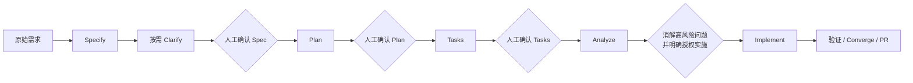

# 需求驱动开发流程

> 适用对象：产品负责人、开发者、评审人和 AI 编码助手
> 工具基线：GitHub Spec Kit `v0.16.3`
> 核心原则：先确认要解决什么，再决定怎么实现

本流程用来把真实业务需求稳定地转化为可验收的实现，同时约束 AI 不根据仓库名、页面猜测或通用最佳实践自由发挥。Spec Kit 只是流程载体；人工确认的需求、仓库真实事实和已有工程边界仍然是决策依据。

## 1. 三类核心工件

每个需求使用一个带顺序号的独立目录：

```text
specs/NNN-short-name/
├── spec.md
├── plan.md
├── tasks.md
└── checklists/
```

三类工件不是同一份文档的三种写法，它们分别回答不同问题：

| 工件 | 只回答 | 不应包含 | 确认人 |
|---|---|---|---|
| `spec.md` | 为什么做、谁在什么场景使用、要得到什么结果、业务规则、验收标准、非目标 | 接口路径、表字段、框架选型、类名、目录结构和代码方案 | 产品/需求负责人 |
| `plan.md` | 如何在现有工程中实现已确认需求，包括影响边界、契约变化、数据设计、风险和验证方案 | 未经确认的新业务目标，也不能借技术方案扩大范围 | 技术负责人/指定评审人 |
| `tasks.md` | 按依赖和用户场景拆分的可执行任务，每项对应真实文件和验证结果 | 空泛的“完善后端”、“优化页面”，以及需求和方案之外的顺手改造 | 实施负责人/指定评审人 |

`research.md`、`data-model.md`、`contracts/` 或 `quickstart.md` 是按需生成的计划辅助工件，不是每个需求的固定问卷。

### 1.1 哪些改动必须走完整流程

新增或改变业务行为、用户场景、权限结果、数据生命周期、对外契约或验收口径时，必须走完整的 Spec → Plan → Tasks → Analyze → Implement 门禁。

纯工程维护可以使用精简通道，例如：恢复已经明确记录的既有行为、修正文案错字、升级独立治理工具、整理不改变运行行为的目录或修复构建配置。这类改动在 PR 中把 Spec 写为“不适用”并说明依据，仍要做方案核对、受影响范围验证和人工评审。只要维护改动需要重新决定用户结果、业务规则或验收标准，就不再属于精简通道，必须回到完整 Spec。

## 2. Spec 必须以需求为中心

`spec.md` 只应出现业务语言，并且至少说清：

1. **WHY**：当前问题、目标和业务价值；
2. **WHO**：真实使用者或受影响角色；
3. **WHAT**：使用者要完成的结果，而不是系统内部动作；
4. **场景**：从触发到结果的主要流程、异常和边界；
5. **业务规则**：可以由业务人员判断对错的约束；
6. **验收标准**：可观察、可验证的结果；
7. **非目标**：本次明确不做的事。

例如，“运营人员可以将一个应用用户设为无效，被停用用户的现有会话在下一次受保护请求时失效”属于需求；“增加某 Controller、修改某字段并清除 Redis key”属于方案，应放入 `plan.md`。

如果需求仍有会改变范围或验收结果的疑问，先执行 Clarify；只询问高影响、无法从业务上合理推导的问题，不要用技术问卷要求产品人员选框架、选表或选接口。

## 3. 强制门禁



门禁的判定规则：

- **Spec 门禁**：业务问题已解决，需求负责人明确表示 `spec.md` 可以作为本次目标；只有“继续”但上下文仍有未确认问题时，不视为通过。
- **Plan 门禁**：方案已对齐真实 Controller、VO、POM、Schema、设计系统和最近邻实现，并已说明范围、风险与验证方式。
- **Tasks 门禁**：任务可执行、有依赖顺序，能追溯到用户场景/业务规则/验收标准，并只修改已确认范围。
- **Analyze 门禁**：在实现前进行非破坏性一致性检查；矛盾、遗漏和重大风险必须先修正或由有权决策者明确接受。
- **Implement 门禁**：通过 Analyze 不等于自动开始写代码。必须再获得“按已确认的 Tasks 开始实现”这类明确授权。

“人工确认”必须能指向真实人员和当前评审上下文：Spec 由需求负责人确认，Plan 由用户或其明确指定的技术评审人确认，Tasks 由用户或其明确指定的实施评审人确认；CRITICAL/HIGH 风险只能由用户或其明确授权且对该风险负责的人接受。AI、自动 workflow 和工件作者都不能自我批准，也不能从职位名称或上一阶段确认中推断授权。

任一门禁未通过时，AI 可以继续做只读核对、补充当前工件或提出少量关键问题，但不得越级生成后续工件或修改业务代码。

## 4. 在本仓库中使用 Spec Kit

仓库只有一套项目级 Spec Kit 设施：

- `.specify/`：全仓库共用的约法、脚本、模板和本地状态；
- `.agents/skills/speckit-*/`：Codex 使用的 Spec Kit Skills；
- `.claude/skills/speckit-*/`：Claude Code 使用的 Spec Kit Skills；
- `specs/`：人类、Codex 和 Claude 共用的需求工件。

不要在 `backend/`、Admin、Client 或任一前端再初始化子 `.specify/`。多个 Agent 可以读取同一份已确认工件，但同一时刻应只有一个负责人修改某份 Spec、Plan 或 Tasks，避免覆盖。

标准命令对应关系：

| 阶段 | Codex | Claude Code |
|---|---|---|
| 编写需求 | `$speckit-specify` | `/speckit-specify` |
| 澄清需求 | `$speckit-clarify` | `/speckit-clarify` |
| 制定方案 | `$speckit-plan` | `/speckit-plan` |
| 拆分任务 | `$speckit-tasks` | `/speckit-tasks` |
| 一致性检查 | `$speckit-analyze` | `/speckit-analyze` |
| 实施 | `$speckit-implement` | `/speckit-implement` |
| 收敛遗漏 | `$speckit-converge` | `/speckit-converge` |
| 发布任务为 Issue | `$speckit-taskstoissues` | `/speckit-taskstoissues` |

命令只执行当前门禁允许的工作。如果客户端展示的 Skill 调用语法有差异，以其当前提示为准，Skill 名称保持 `speckit-*`。

Converge 一旦补充任务，`tasks.md` 必须恢复为草稿并重新经过 Tasks 确认、Analyze 和实施授权。
TasksToIssues 会写入 GitHub，只有当前请求明确授权创建 Issue 且目标仓库清楚时才可执行；确认
Tasks 或授权 Implement 都不自动包含这项外部写入权限。

## 5. 需求目录与 Git 分支独立

`specs/001-xxx` 中的 `001` 是需求工件的顺序号，用于定位和追溯；它不是 Git 分支名，也不自动创建、切换或合并分支。Git 仍完整遵循 [Git 分支与提交规范](../git-workflow-spec.md)。

单个需求时，Spec Kit 会用本地的 `.specify/feature.json` 记住当前需求目录；该文件是机器本地状态，不进入提交。

并行处理多个需求时，二选一：

1. **推荐：每个需求使用独立 Git worktree**，分离分支、工作目录和本地 feature 指针；
2. **同一工作目录内显式指定** `SPECIFY_FEATURE_DIRECTORY=specs/NNN-short-name`，每次执行后续步骤前确认目标，不依赖会被其他任务改写的本地指针。

不要让两个并行 Agent 在同一工作目录中同时修改 `.specify/feature.json` 或同一需求工件。

## 6. 本仓库的采用范围

本仓库使用 Spec Kit 核心流程和项目本地模板，不默认执行捆绑的一键 workflow。一键串行无法代替 Spec、Plan、Tasks 的人工确认和实施前授权。

当前明确不安装：

- `git` 扩展：需求目录与仓库已有 GitHub Flow 分开管理；
- `lean` preset：不删减 Clarify、Analyze 和质量门禁；
- `agent-context` 扩展：项目事实仍由现有文档和真实代码维护；
- 任何社区扩展：未经单独评审和人工批准，不引入本仓库。

扩展、preset 或 workflow 的引入会改变 Agent 行为和工件，必须作为独立工程治理变更评审，不得在业务需求中顺手安装。

## 7. 实现前的事实核对

Spec 通过后，Plan 必须根据受影响范围阅读真实工程：

- 目标后端的 Controller、VO、Service、Mapper、POM 与 Schema；
- 目标前端自己的请求层、类型、页面和环境配置；
- [`CLAUDE.md`](../CLAUDE.md) 中的 Admin / Client / Common、认证和数据边界；
- UI 需求对应的 [`AI-设计系统上下文.md`](./AI-设计系统上下文.md) 和目标平台规范；
- 与本需求最接近、已经运行的实现。

不得只根据 README、一般技术常识或上游框架示例生成方案。如果真实代码与文档冲突，先报告冲突并确认目标，不得选择更容易实现的一方。

## 8. 验证、PR 与当前自动化程度

实现完成后，必须逐条对照验收标准，并按受影响范围完成构建、静态检查、必要测试和运行验证。Converge 用来对照 Spec、Plan、Tasks 查找尚未完成的工作，不用来更改已确认需求。

本地检查命令：

```bash
# 检查 Spec Kit 版本、项目 preset、Codex/Claude Skills、模板和扩展边界
node scripts/verify-spec-kit.mjs

# 检查全部需求工件的结构；也可传入单个 Feature 目录
node .specify/scripts/verify-specs.mjs
node .specify/scripts/verify-specs.mjs specs/NNN-short-name

# 进入 Plan 前的严格检查：已确认、无待确认问题、需求检查清单已完成
node .specify/scripts/verify-specs.mjs specs/NNN-short-name --ready

# Analyze / Implement / Converge / TasksToIssues 前：三份工件均已确认且确认依据完整
node .specify/scripts/verify-specs.mjs specs/NNN-short-name --artifacts-ready
```

当前仓库**没有 GitHub Actions 或自动 CI 状态检查**。Spec Kit 的引入没有改变这一事实，也不能将本地脚本写成“CI 已通过”。在 CI 建成前：

1. 本地执行需求工件检查和受影响范围验证；
2. 在 PR 中写明 Spec 目录、验收标准对应结果、实际执行的命令和未验证范围；
3. 由评审人确认工件与代码一致后再合并。

分支、提交、PR 与 Squash 合并仍以 [Git 分支与提交规范](../git-workflow-spec.md) 为唯一详细依据。

## 9. AI 必须停下来的情况

AI 遇到以下任一情况时，先报告事实和影响，再请求决策：

- Spec 还有会改变范围、角色、业务规则或验收结果的问题；
- 方案需要超出已确认的 Admin / Client / Common 边界；
- 需要新增顶层工程、新框架、新运行服务或扩展项目采用范围；
- 真实接口/数据库/设计系统与需求或文档相互冲突；
- Analyze 发现仍未处理的重大矛盾、遗漏或风险；
- 实施过程必须扩大范围，或验收标准已无法按原方案达成。

需求已确认并不等于 AI 可以填补所有未定义业务；工程中已经存在某个能力，也不等于本次需求已授权使用或改造它。

## 10. 维护和升级

Spec Kit 版本升级必须作为独立治理变更：查看上游 Release Notes，核对 Codex/Claude 集成状态，确认项目本地模板未被覆盖，再执行工件和脚本验证。不在业务 PR 中顺手升级，也不使用未发布分支或预发布版本。

项目 Preset 会完整替换 8 条受控命令（Specify、Clarify、Plan、Tasks、Analyze、Implement、
Converge、TasksToIssues），并分别物化进 Codex 与 Claude 的 Skill。因此官方
`specify integration status` 当前会把这 16 个生成产物报告为 `modified managed files`。
这是已知的 Preset 结果，不代表有人手工篡改 Skill；不要因为该提示直接执行
`integration upgrade --force`，否则可能覆盖项目门禁。日常完整性判断以
`node scripts/verify-spec-kit.mjs` 为准。

升级官方核心后，必须运行 `bash scripts/sync-spec-kit-integrations.sh`，让当前项目 Preset
先重新物化到 Claude、再重新物化到默认的 Codex，并执行完整性校验。不要只升级其中一套
集成，也不要手工编辑生成后的 Skill。

项目约束与事实的阅读顺序见 [`AGENTS.md`](../AGENTS.md)、[`CLAUDE.md`](../CLAUDE.md) 和 [工程现状与开发导航](./工程现状.md)。
